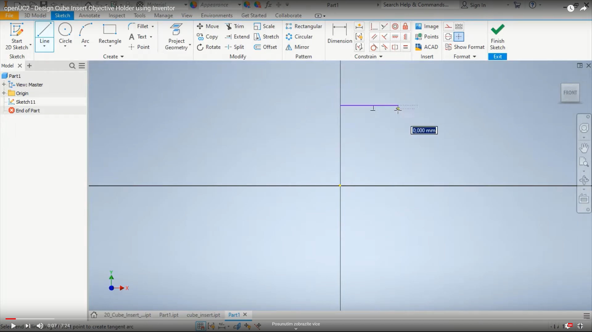

<p align="left">
<a href="#logo" name="logo"></a>
</p>

# openUC2 Template for your own Insert
 
---


We try to keep UC2 as open as possible. One important step is to give you the tools at hand to create your own insert in Order to add own functionalities, parts, modules, etc. 
This repository should help you creating inserts and understand the core idea behind the shape and how it can be used to add e.g. lenses, mirros, motors. 

If you have a more complex idea for a module, say a rotating diffuser, please feel free to reach out to us! We are happy to support your research with open-source tools! 

A good resource is also the [***Module Developer Kit (MDK)***](https://github.com/openUC2/UC2-GIT/tree/master/MDK) that summarizes the core concept of UC2's modularity. 


***What you will see here:***

* UC2 Cube Inserts
* Design files for 
	* Autodesk Inventor
	* OpenSCAD
	* Fusion360
	* STP- and STL-files
* Technical drawings to replicate module in e.g. metal?
* Tutorial to design your modules in Autodesk


### UC2 Cube Inserts

The cube inserts can be fully customized to adapt any optical element to the cubes. So far a perpendicular and diagonal version exists. The design files for Autodesk Inventor and OpenSCAD are available. Once you have a customized version, please share it so that the open-aspect of the system reaches its full potential :)

Since the cube is point symmetric around the origin, the inserts can be rotated in all directions and bridges external components to the modules by acting as an open-standard.

When you create a new insert, you have to make sure it follows the following design criteria (e.g. dimensions):

<p align=center>

<br><em>CAD for UC2 Cube insert</em>
</p>

For the baseplate you must follow these dimensions:

<p align=center>

<br><em>CAD for UC2 Cube baseplate</em>
</p>

The CAD templates for Autodesk Inventor 2022 (```.ipt```) and ```STL/STEP```-standard can be found in the [INVENTOR](./INVENTOR)-folder and  [STL](./STL)/ [STP](./STP)-folder .


## Autodesk Inventor 2022 Design files

All files can be found in the folder [INVENTOR](./INVENTOR).

***Steps to work on the files:***

1. Open Autodesk Inventor 2022
2. Create a new project
3. Open the Assembly file: `Assembly_Cube_Template_v3.iam`
4. Get yourself familiar with the:
- Cube
- Baseplate
- Insert
5. Try modifying the file `20_Cube_Insert_Template_v3.ipt` so that you can mount your inidividual files

### Videotutorial

We have a dedicated video tutorial to show how you can create your own insert.
**Video Tutorial on How to design a Cube Insert (Perpendicular to the optical axis)**  
**The tutorial shows a v2 insert - the principle is the same but the dimensions differ!**

[](https://www.youtube.com/watch?v=q2DNw-Q1KEo&t=2s)


## OpenSCAD Design files


All files can be found in the folder [OPENSCAD](./OPENSCAD).

***Steps to work on the files:***

1. Open OpenSCAD
2. Open the file `UC2_Lens_insert_v2.scad`
3. Try to understand what each parameter modifies in the geometry of the cube insert
4. Render and export as STL


## Get Involved

This project is open so that anyone can get involved. You don't even have to learn CAD designing or programming. Find ways you can contribute in  [CONTRIBUTING](https://github.com/openUC2/UC2-GIT/blob/master/CONTRIBUTING.md)


## License and Collaboration

This project is open-source and is released under the CERN open hardware license. Our aim is to make the kits commercially available.
We encourage everyone who is using our Toolbox to share their results and ideas, so that the Toolbox keeps improving. It should serve as a easy-to-use and easy-to-access general purpose building block solution for the area of STEAM education. All the design files are generally for free, but we would like to hear from you how is it going.

You're free to fork the project and enhance it. If you have any suggestions to improve it or add any additional functions make a pull-request or file an issue.

Please find the type of licenses [here](https://github.com/openUC2/UC2-GIT/blob/master/License.md)

REMARK: All files have been designed using Autodesk Inventor 2019 (EDUCATION)


## Collaborating
If you find this project useful, please like this repository, follow us on Twitter and cite the webpage! :-)
